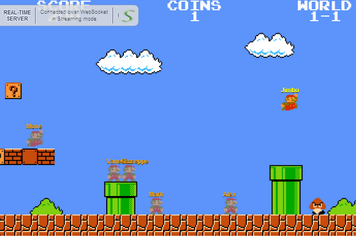

# Lightstreamer - FullScreenMario Demo - HTML Client

<!-- START DESCRIPTION lightstreamer-example-fullscreenmario-client-javascript -->

This project is forked from [FullScreenMario](https://github.com/Diogenesthecynic/FullScreenMario), an HTML5 remake of the original Super Mario Brothers. 
The goal of this fork is to create a multi-player version of <b>FullScreenMario</b>, based on Lightstreamer.
This project is just a proof of concept, to experiment a multi-player game based on a client side mode.

## Details

This *FullScreenMario Demo* implements a simple gaming/collaborative application fed in real-time via a Lightstreamer server.

It's based on client-side mode:
- Physics runs on the client side only,
- User's commands (key press, joystick move, device tilt, accelerometer, etc.) are streamed from client to server,
- Commands of all other users are broadcast from server to each client,
- Each client calculate the world independently,

Once logged in, the user can start move his or her Super Mario avatar and will see other user's avatar moving, too. For each user, a Super Mario avatar is created, on the bottom of which the nickname chosen by the user is displayed.

The demo includes the following client-side functionalities:
* A [Subscription](http://www.lightstreamer.com/docs/client_javascript_uni_api/Subscription.html) containing 1 item, subscribed to in <b>COMMAND</b> mode. Each added player automatically provokes an underlying subscription to a sub-item in **MERGE** mode, to get the real-time position and state for that specific player from another feed. When a player is deleted, the underlying sub-item is automatically unsubscribed from.
* The user messages are sent to the Lightstreamer Server using the [LightstreamerClient.sendMessage](http://www.lightstreamer.com/docs/client_javascript_uni_api/LightstreamerClient.html#sendMessage) utility.

<!-- END DESCRIPTION lightstreamer-example-fullscreenmario-client-javascript -->

## Install

* As prerequisite, the [FullScreenMario Demo - Java Adapter](https://github.com/Lightstreamer/Lightstreamer-example-FullScreenMario-adapter-java#clients-using-this-adapter) has to be deployed in your local Lightstreamer Server instance. Please check out that project and follow the installation instructions provided with it.
* Download this project
* Get the `lightstreamer.js` file from the [latest Lightstreamer distribution](http://www.lightstreamer.com/download) 
  and put it in the `src` folder of the demo. Alternatively, you can build a `lightstreamer.js` file from the 
  [online generator](http://www.lightstreamer.com/docs/client_javascript_tools/generator.html).
  In that case, be sure to include the LightstreamerClient, Subscription, DynaGrid, and StatusWidget modules and to use the "Use AMD" version.
* Get the `require.js` file form [requirejs.org](http://requirejs.org/docs/download.html) and put it in the `src` folder of the demo.
-  Get the `gamecontroller.min.js` file from [HTML5 Virtual Game Controller](https://github.com/austinhallock/html5-virtual-game-controller) and put it in the `src` folder of the demo.
* Deploy this demo on the Lightstreamer Server (used as Web server) or in any external Web Server. Create the folders `<LS_HOME>/pages/demos/FullScreenMario` and copy here the contents of the `/src` folder of this project.
The client demo configuration assumes that Lightstreamer Server, Lightstreamer Adapters, and this client are launched on the same machine. If you need to target a different Lightstreamer server, please search in `FullScreenMario/lsClient.js` this line:  `  var lsClient = new LightstreamerClient(protocolToUse+"//localhost:8080","MARIO");`  and change it accordingly.
* Open your browser and point it to: [http://localhost:8080/demos/FullScreenMario/](http://localhost:8080/demos/FullScreenMario/)

## See Also 

### Lightstreamer Adapters Needed by This Client

<!-- START RELATED_ENTRIES -->
* [Lightstreamer - FullScreenMario Demo - Java  Adapter](https://github.com/Lightstreamer/Lightstreamer-example-FullScreenMario-adapter-java)

<!-- END RELATED_ENTRIES -->

### Related Projects

* [Lightstreamer - Room-Ball Demo - HTML Client](https://github.com/Lightstreamer/Lightstreamer-example-RoomBall-client-javascript)

## Lightstreamer Compatibility Notes

- Compatible with Lightstreamer JavaScript Client library version 6.0 or newer.

## License

This is released under the [Attribution Non-Commercial Share-Alike](http://creativecommons.org/licenses/by-nc-sa/3.0/) license. Full Screen Mario is meant to be both a proof of concept and an entertaining past time, not a source of income.
